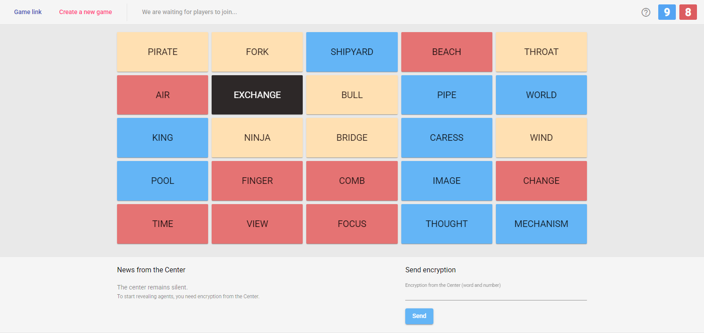

## First Thing First
All the credits are to: https://github.com/koldoon/codenames-game  
I only offered English UI translation, alongside 133 generated translations for the board words.

## About
Codenames is a popular board game when two teams must reveal their hidden cards with the help of their spy. The spy is the only one who can see which cards belong to which team.

## Download
This repository contains binaries for Windows, Mac, Linux and AIX operating systems, based on the source code of `koldoon/codenames-game`. Built using `Node.js`.

Go to the [releases](https://github.com/Mohyoo/Codenames-Binaries/releases) page to download.  
I could only test the Windows binaries, if anyone faces issues with other platforms, please let me know.

The game support LAN mode (local network); and for it to work, the players need to connect to the same Wi-Fi network.
